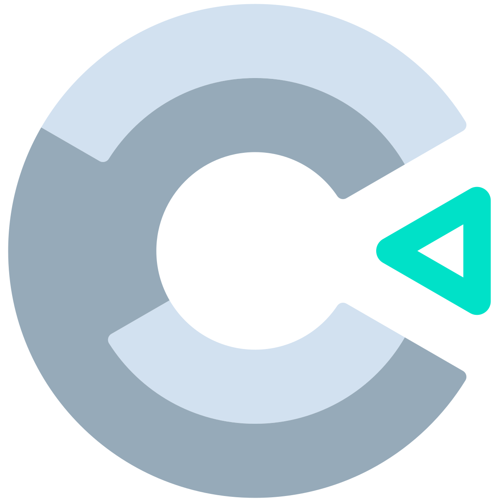

# CURSO DE CONSTRUCT 3
👨‍⚖️CONSTRUCT 3 É UM SOFTWARE DE CRIAÇÃO DE JOGOS E APLICATIVOS BASEADO EM HTML5. ELE PERMITE QUE OS USUÁRIOS DESENVOLVAM JOGOS E APLICATIVOS INTERATIVOS SEM A NECESSIDADE DE CONHECIMENTO AVANÇADO EM PROGRAMAÇÃO.

  

## CONCEITO:
O Construt 3, ou Construct 3, é uma plataforma de desenvolvimento de jogos e aplicativos que permite criar jogos, aplicativos interativos e outros projetos sem a necessidade de programação tradicional. Ele é conhecido como um "construct" ou construtor de jogos, pois oferece uma interface visual intuitiva que permite aos usuários criar seus projetos simplesmente arrastando e soltando elementos e definindo eventos e ações através de lógica baseada em eventos.

Aqui estão alguns conceitos-chave do Construct 3:

1. Interface Visual: O Construct 3 fornece uma interface visual, na qual os elementos do jogo, como personagens, objetos, cenários e menus, podem ser colocados na tela simplesmente arrastando-os e soltando-os. Isso torna o processo de criação de jogos mais acessível para pessoas que não têm experiência em programação.

2. Lógica Baseada em Eventos: Em vez de escrever código, os desenvolvedores usam uma lógica baseada em eventos para definir o comportamento dos elementos do jogo. Os eventos são acionados por ações específicas, como colisões, cliques do mouse ou teclas pressionadas, e você pode definir quais ações devem ocorrer em resposta a esses eventos.

3. Biblioteca de Comportamentos e Plugins: O Construct 3 oferece uma biblioteca de comportamentos e plugins pré-construídos que podem ser aplicados aos elementos do jogo para adicionar funcionalidades específicas, como física, detecção de colisões, animações e muito mais. Isso economiza tempo e facilita a criação de jogos complexos.

4. Exportação Multiplataforma: Os jogos criados no Construct 3 podem ser exportados para várias plataformas, incluindo PC, dispositivos móveis, consoles e a web. Isso permite que os desenvolvedores alcancem um público amplo com seus jogos.

5. Comunidade e Recursos: O Construct 3 tem uma comunidade ativa de desenvolvedores e oferece uma variedade de tutoriais, documentação e fóruns de suporte para ajudar os usuários a aprender e resolver problemas.

## CARACTERÍSTICAS:
### POSITIVAS:
- **Sem Programação (No-Code):** Construct 3 é uma plataforma de desenvolvimento de jogos que permite criar jogos sem a necessidade de programação, utilizando uma abordagem "no-code".

- **Interface Amigável:** Possui uma interface intuitiva e amigável, tornando o processo de criação de jogos acessível para iniciantes e designers sem conhecimento de programação.

- **Multiplataforma:** Permite exportar jogos para diversas plataformas, incluindo Windows, macOS, Linux, Android, iOS e navegadores da web.

- **Biblioteca de Recursos:** Oferece uma ampla biblioteca de recursos, sprites e efeitos pré-construídos que podem ser facilmente integrados nos jogos.

- **Colaboração Online:** Suporta colaboração online, permitindo que equipes trabalhem juntas em projetos de jogos de forma eficiente.

- **Atualizações Regulares:** A plataforma recebe atualizações regulares, introduzindo novos recursos e melhorias de desempenho.

### NEGATIVAS:
- **Limitações para Projetos Complexos:** Para projetos de jogos mais complexos, o Construct 3 pode apresentar limitações em comparação com ambientes de desenvolvimento tradicionais.

- **Personalização Limitada:** A personalização do código e o controle detalhado sobre a lógica do jogo podem ser limitados em comparação com linguagens de programação tradicionais.

- **Custo:** Alguns recursos e exportações para determinadas plataformas podem exigir uma assinatura paga, o que pode representar um custo para desenvolvedores.

- **Dependência da Internet:** A colaboração online e alguns recursos podem depender de uma conexão constante com a internet.

- **Não Adequado para Todos os Tipos de Jogos:** Projetos específicos ou gêneros de jogos podem encontrar limitações em termos de desempenho ou flexibilidade no Construct 3.

- **Aprendizado Limitado em Programação:** Embora seja uma ferramenta no-code, não proporciona aprendizado direto em programação, o que pode ser uma desvantagem para quem busca adquirir habilidades de codificação.

## SUBSIDIOS:
- [CURSO CRIADO PELO "RENAN SILVA - CRIAÇÃO DE JOGOS"](https://youtube.com/playlist?list=PLYOZqxNe79xL1Y7yXGZoPED-CNcqTTxJg&si=auMxr9LeOPiZEs-S)
- [CURSO FEITO PELO VILHALVA](https://github.com/VILHALVA)
- [ACESSE A ENGINE](https://www.construct.net/en/register)

